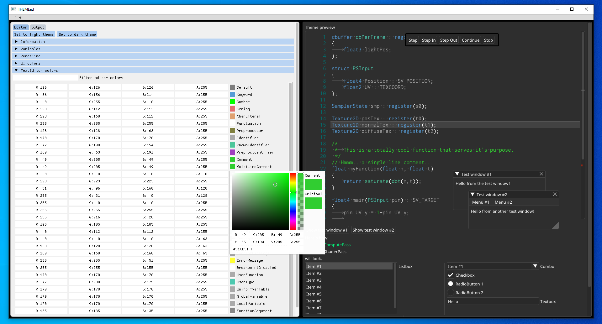
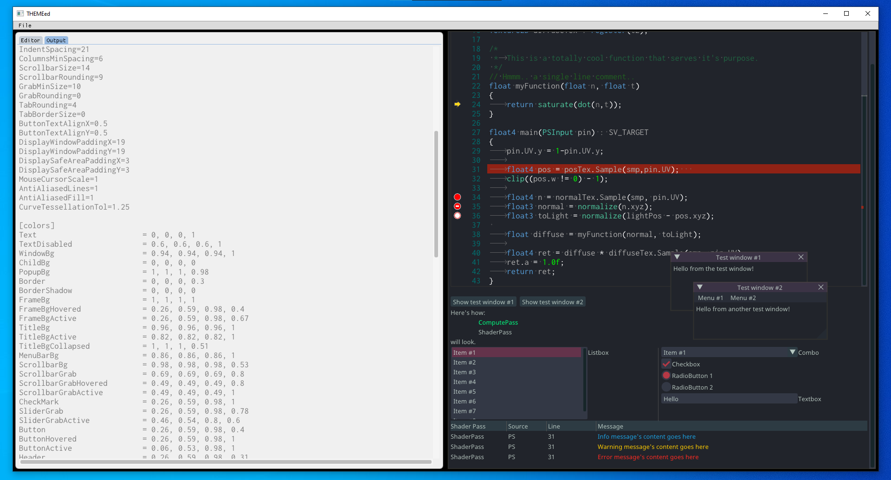
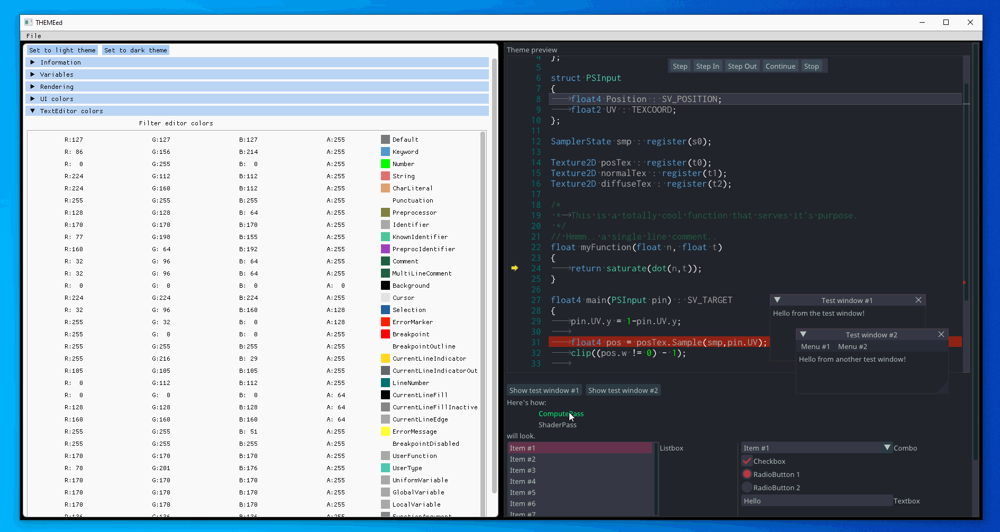

# THEMEed
THEMEed is a simple tool built for designing SHADERed themes.
It has a live preview of the theme you are working on.

Upload your own theme to SHADERed's database [here](https://shadered.org/upload_theme).



## Building
First, install SDL2 through your package manager and then run these commands:
```bash
git clone https://github.com/dfranx/THEMEed.git
cd THEMEed
git submodule update --init
cmake .
make
```

## Screenshots


Live preview


## Supporters
**Supporter(s):**
  * [Hugo Locurcio](https://hugo.pro)
  * Senthil Kumaran Rajasekaran
  * [Vladimir Alyamkin](https://alyamkin.com/)
  * [Wogos Media](http://theWogos.com/)

## Dependencies
This project uses:
 - [ocornut/imgui](https://github.com/ocornut/imgui/tree/docking) (docking + tables branch)
 - [BalazsJako/ImGuiColorTextEdit](https://github.com/BalazsJako/ImGuiColorTextEdit)
 - [benhoyt/inih](https://github.com/benhoyt/inih)
 - [aiekick/ImGuiFileDialog](https://github.com/aiekick/ImGuiFileDialog)
 - [SDL2](https://www.libsdl.org/)

## LICENSE
THEMEed is licensed under MIT license. See [LICENSE](./LICENSE) for more details.
